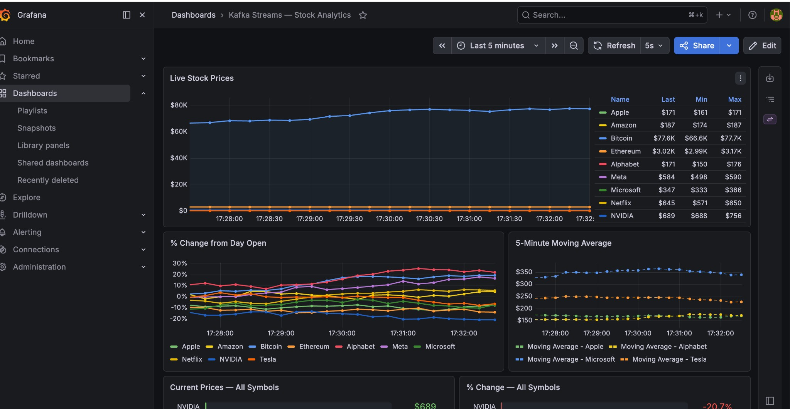
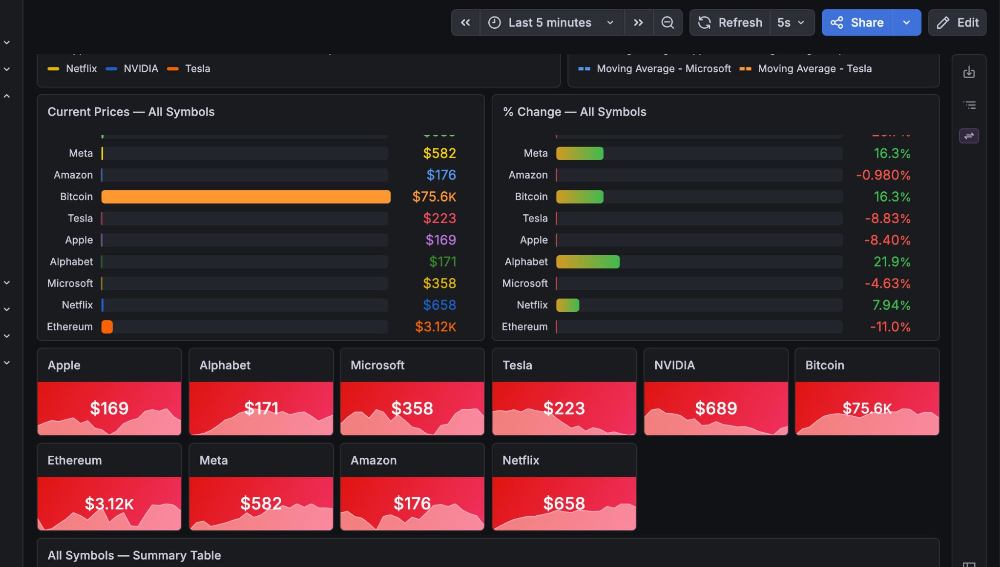
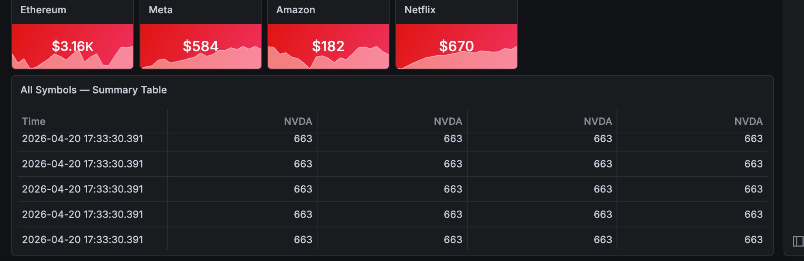

# Real-time Stock Analytics with Kafka Streams

A fully working Spring Boot application that simulates live stock price ticks,
processes them through a Kafka Streams topology, and displays the results on a
real-time HTML dashboard.

## Kafka Streams Concepts Demonstrated

| Concept | Where |
|---|---|
| `KStream` | Raw tick consumption in `StockStreamsTopology` |
| `KTable` aggregation | Latest price per symbol (`latest-price-store`) |
| Tumbling Window | 1-minute OHLCV candles (`ohlcv-store`) |
| Sliding Window | 5-minute moving average (`moving-avg-store`) |
| Interactive Queries | `StockQueryService` — query state stores via REST |
| Custom Serde | `JsonSerde<T>` — reusable generic JSON serializer |

## Project Structure

```
stock-analytics/
├── docker-compose.yml          ← Kafka + Zookeeper + Kafka-UI
├── pom.xml
└── src/main/
    ├── java/com/stocks/
    │   ├── StockAnalyticsApplication.java
    │   ├── config/KafkaStreamsConfig.java   ← Streams + WebSocket config
    │   ├── model/
    │   │   ├── StockTick.java               ← symbol, price, volume, timestamp
    │   │   ├── OhlcvCandle.java             ← open, high, low, close, volume
    │   │   └── StockSummary.java            ← REST DTO
    │   ├── serde/JsonSerde.java             ← generic JSON serde
    │   ├── producer/StockPriceProducer.java ← @Scheduled, random walk
    │   ├── streams/StockStreamsTopology.java ← THE Kafka Streams topology
    │   ├── service/StockQueryService.java   ← Interactive Queries
    │   └── api/
    │       ├── StockRestController.java     ← REST /api/stocks
    │       └── StockWebSocketController.java← push /topic/stocks every 1s
    └── resources/
        ├── application.yml
        └── static/                          ← Dashboard
            ├── index.html
            ├── app.js
            └── style.css
```

## Prerequisites

- Java 17+
- Maven 3.8+
- Docker + Docker Compose

## Running

### 1. Start Kafka

```bash
cd stock-analytics
docker compose up -d
```

Wait ~15 seconds for Kafka to be ready.

### 2. Start the Application

```bash
mvn spring-boot:run
```

### 3. Open Dashboard

```
Application: http://localhost:8070
Grafana: http://localhost:3000
```

### Optional: Kafka UI

View topics, consumer groups, and messages at:
```
http://localhost:8085
```

## REST API

| Endpoint | Description |
|---|---|
| `GET /api/stocks` | All symbols — latest price, % change, MA |
| `GET /api/stocks/{symbol}/latest` | Raw latest tick |
| `GET /api/stocks/{symbol}/candles?limit=30` | OHLCV candles from state store |
| `GET /api/stocks/{symbol}/moving-avg` | 5-minute moving average |

## Dashboard Screenshots

### Grafana Overview



### Symbol Panels and Gauges



### Summary Table



## Architecture Flow

```
StockPriceProducer (500ms)
    → stock-ticks (Kafka topic)
        → KStream
            ├── groupByKey().aggregate()          → latest-price-store (KV store)
            ├── windowedBy(1min).aggregate()      → ohlcv-store (Window store)
            └── windowedBy(SlidingWindow5m).agg() → moving-avg-store (Window store)

StockQueryService   → Interactive Queries → state stores
StockWebSocketCtrl  → pushes summaries every 1s via /topic/stocks
Dashboard (app.js)  → STOMP WebSocket + REST for candles
```
